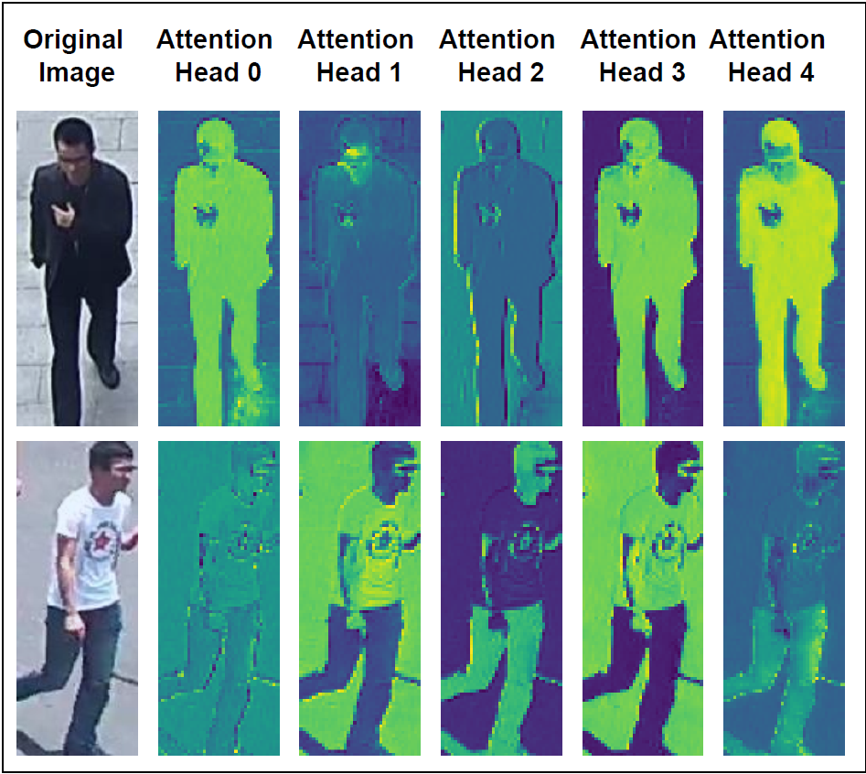
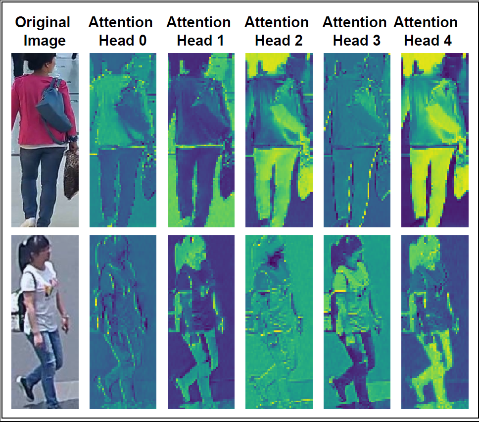

# EE 782 - Course Project Repo

# Person Re-ID through SSL using DINO
This is the PyTorch implmentation of the paper **Person Re-Identification through Self-Supervised Learning using Distillation of knowledge with NO labels*.

## Model Architecture 🏗️

<p align="center"></p>

## Table of Contents 📋
- [EE 782 - Course Project Repo](#ee-782---course-project-repo)
- [Person Re-ID through SSL using DINO](#person-re-id-through-ssl-using-dino)
  - [Model Architecture 🏗️](#model-architecture-️)
  - [Table of Contents 📋](#table-of-contents-)
  - [Getting Started 🚀](#getting-started-)
    - [Environment](#environment)
    - [Installation](#installation)
  - [Repository Structure 📂](#repository-structure-)
  - [Download \& Pre-process Datasets](#download--pre-process-datasets)
  - [Pre-training using DINO framework](#pre-training-using-dino-framework)
  - [Fine-tuning using Torchreid](#fine-tuning-using-torchreid)
  - [Visualizations 📊](#visualizations-)
  - [Collaborators:](#collaborators)

## Getting Started 🚀
### Environment
- Tested OS: Linux
- Python >= 3.9
- PyTorch == 2.0
### Installation
  1. Clone the repository to your local machine.
  2. Navigate to the project directory: `cd person_ReID`
  3. Create the environment and install the requirements using `source build_env.sh`

## Repository Structure 📂
The repository is structured as follows:

```
📦 Person Re-ID
 ┣ 📂 configs
  ┣ 📜 osnet_x1_0_pretrained.yaml
  ┣ 📜 osnet_x1_0.yaml
  ┣ 📜 resnet50_pretrained.yaml
  ┣ 📜 resnet50.yaml
 ┣ 📂 datasets
 ┃ ┣ 📂 market1501
 ┃ ┣ 📂 PA-100K
 ┃ build_env.sh 
 ┃ down_process_datasets.bash
 ┃ main_dino.py
 ┃ main.py
 ┃ visualize_attention.py
 ┗ 📜 README.md (You are here!)
```

## Download & Pre-process Datasets
* Download Market 1501 & PA-100K datasets, images and annotations, using:
```bash
bash down_process_datasets.bash
```
* To pre-process the downloaded datasets, run the following command:
```python
python pre_process_data.py --num_classes 10 --num_images 100000 
```
* The datasets will be downloaded so that its structure is like the one shown above.

## Pre-training using DINO framework 
To pre-train the model on PA-100K dataset, run the following command:
> Pre-training OSNet using DINO
```
python main_dino.py --arch osnet --optimizer sgd --lr 0.03 --weight_decay 1e-4 --weight_decay_end 1e-4 --global_crops_scale 0.14 1 --local_crops_scale 0.05 0.14 --data_path ./dataset/PA-100K/processed_imgs_for_dino --output_dir ./osnet_dino_100k 
```
> Pre-training Resnet50 using DINO
```
main_dino.py --arch resnet50 --optimizer sgd --lr 0.03 --weight_decay 1e-4 --weight_decay_end 1e-4 --global_crops_scale 0.14 1 --local_crops_scale 0.05 0.14 --data_path ./dataset/PA-100K/processed_imgs_for_dino --output_dir ./resnet50_dino_100k
```

## Fine-tuning using Torchreid
To fine-tune the model on Market 1501 dataset, run the following command:
> Fine-tuning OSNet
```
python main.py --config-file ./configs/osnet_x1_0_pretrained.yaml --transforms random_flip random_erase --pretrained_model_path ./pretrained_models/pretrained_vanilla_osnet_x1_0.pth
```
> Fine-tuning Resnet50
```
python main.py --config-file ./configs/resnet50_pretrained.yaml --transforms random_flip random_erase --pretrained_model_path ./pretrained_models/pretrained_vanilla_resnet50.pth
```
To train the model from scratch, change the config file to `osnet_x1_0.yaml` or `resnet50.yaml` and remove the `pretrained_model_path` argument. 

## Visualizations 📊

<table align="center" style="width:100%; table-layout:fixed;">
    <tr>
        <td></td>
        <td></td>
    </t
</table>

* Attention Maps can be visualized using:
```python
python visualize_attention.py --pretrained_weights ./pretrained_models/osnet.pth
``` 
 
## Collaborators:
[](https://github.com/munish30monga)
[](https://github.com/uddeshya-iitb)